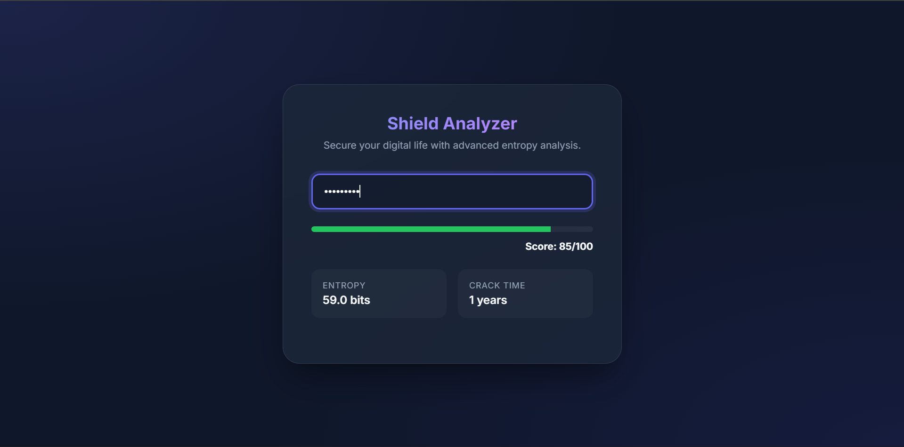

# Password Strength Checker



A comprehensive, high-performance password strength analyzer designed to help users create secure credentials. This tool provides detailed feedback, calculates entropy, and estimates crack times for various attack scenarios.

[](https://opensource.org/licenses/MIT)
[](https://nodejs.org/)

##  Features

- **Advanced Scoring**: 0-100 score based on multiple security factors.
- **Entropy Calculation**: Bit-level entropy measurement for mathematical strength analysis.
- **Crack Time Estimation**: Estimates how long it would take to crack the password offline and online.
- **Real-time Feedback**: Actionable suggestions to improve password security.
- **Dual Interface**: Use it via the Command Line (CLI) or through a clean Web Interface.
- **Pattern Detection**: Identifies common patterns, keyboard sequences, and dictionary words (coming soon).

##  Getting Started

### Prerequisites

- [Node.js](https://nodejs.org/) (v14 or higher)
- npm (comes with Node.js)

### Installation

1. Clone the repository:
   ```bash
   git clone https://github.com/Ey0s/Password-Strength-Checker.git
   cd password-strength-checker
   ```

2. Install dependencies (if any):
   ```bash
   npm install
   ```

##  Usage

### Command Line Interface (CLI)

Run the analyzer directly from your terminal:

```bash
npm start
```

Follow the prompt to enter a password and receive a detailed report.

### Web Interface

To launch the web version:

```bash
npm run web
```
*Note: This requires `serve` or a similar static file server. The command above uses `npx serve`.*

Or simply open `web/index.html` in your favorite browser.

## Project Structure

```text
├── assets/             # Images and design assets
├── data/               # Dictionary and pattern data
├── src/                # Core analysis logic
│   ├── passwordAnalyzer.js  # Main entry point for analysis
│   ├── entropy.js           # Entropy calculations
│   └── crackTime.js        # Crack time estimations
├── web/                # Web interface files
├── cli.js              # CLI entry point
└── package.json        # Project metadata
```

## License

This project is licensed under the MIT License - see the [LICENSE](LICENSE) file for details.

## Contributing

Contributions are welcome! Please feel free to submit a Pull Request.

---

Made by [Eyosyas](https://github.com/ey0s)
